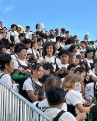

<h2>Social outlet</h2>
I've played in the marching band for four years now. As the largest organization on campus, the marching band consistently provides a way for me to connect with other students from all fields. 

<h2>Creative outlet</h2>
If there's one thing more fun than creating something, it's doing it with your friends. Band to me is a place to go and express yourself, even if it means doing something stupid and embarrassing yourself from time to time. The point is to do stupid stuff together, and to have fun doing it. I love my band and my friends, and I wouldn't give them up for the world.
