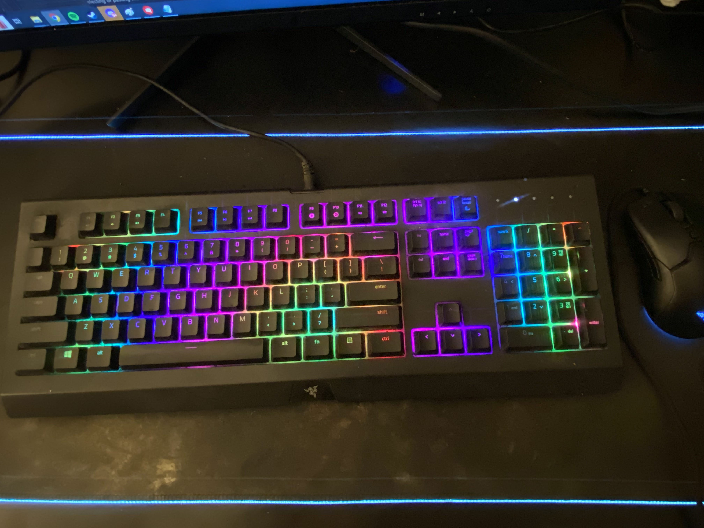

<h2>Rise, my glorious creation!</h2>
I built this computer in the months right before the pandemic. The masterpiece you see before you is the result of many months' efforts of part-picking, assembly, and boot-menu troubleshooting. I had very specific goals in mind for what I wanted out of the computer, which ended up placing some restrictions on how everything went down, but in the end I'm really happy with how it turned out. For example, the giant Video Card being supported by the plastic bobblehead and painter's tape is incredibly heavy, and the whole thing ended up sagging under its own weight, rendering it unusable without support. I also tried to get secondhand parts for a discount price, which ended up costing me more in the long run due to some hardware malfunctions. After replacing the parts, everything has run smoothly so far. 

<h2>Head in the game</h2>
In 2020, having a decent PC was awesome, because my friends and I could just stay inside and play games online while socially distancing. My new specs were a huge change from the 2009 macbook I'd been running on until that point, and it meant I could be in *multiple* applications at once without my computer heating up to surface-of-the-sun temperatures on my lap. I think I made a lot of the friends I keep in contact with now just by being chronically online that year, LOL.

<h2>Hard work pays off</h2>
I think the reason I like this computer so much is that it's the first major money/time sink I've put a lot of effort into. Earning enough cash to actually get the parts I'd been eyeing for months felt really good, and I hope I can take that same feeling of motivation and apply it elsewhere in my life. 
