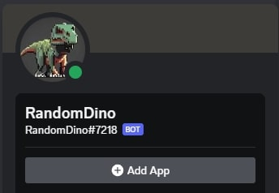

<h1>Doodling with 'Dino</h1>

RandomDino is a simple text-based bot designed for use within Discord. The idea for RandomDino came about through a game my friends played where one person would pick a dinosaur and a description of that dinosaur from a list, and everyone else would have to draw it to the best of their ability. My friends and I put together the code from snippets of Javascript we picked apart online or coded ourselves, and tied them all together using <a href="https://glitch.com/">Glitch</a>, an online JavaScript application-hosting platform. 

<h2>The first stepping stone</h2>

In this project I gained experience with NodeJS and Javascript, GitHub, and online collaboration within a programming-oriented context. Most of the code we put together was written in Microsoft Visual Studio Code, and all the debugging was done in Glitch. I hope the project will serve as a stepping stone for our development of bots and web-hosted apps in the future. 

<h2>Plans for the future</h2>

Currently, RandomDino has a few basic commands, with its most prominent being '!dino', which pulls and subsequently deletes (to avoid duplicate responses) a dino and its descriptor from an offline database.
RandomDino is an ongoing project, and we hope to eventually implement higher-level Discord integration, such as the use of Discord API's 'Slash Commands', to streamline clientside input.

Source: <a href="https://github.com/sage-hoku/random-dino">random-dino</a>
